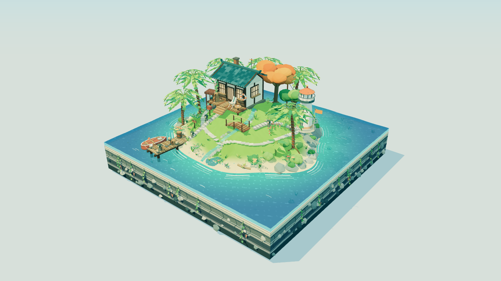
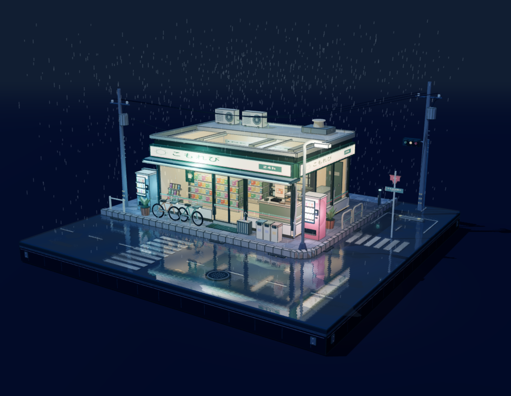
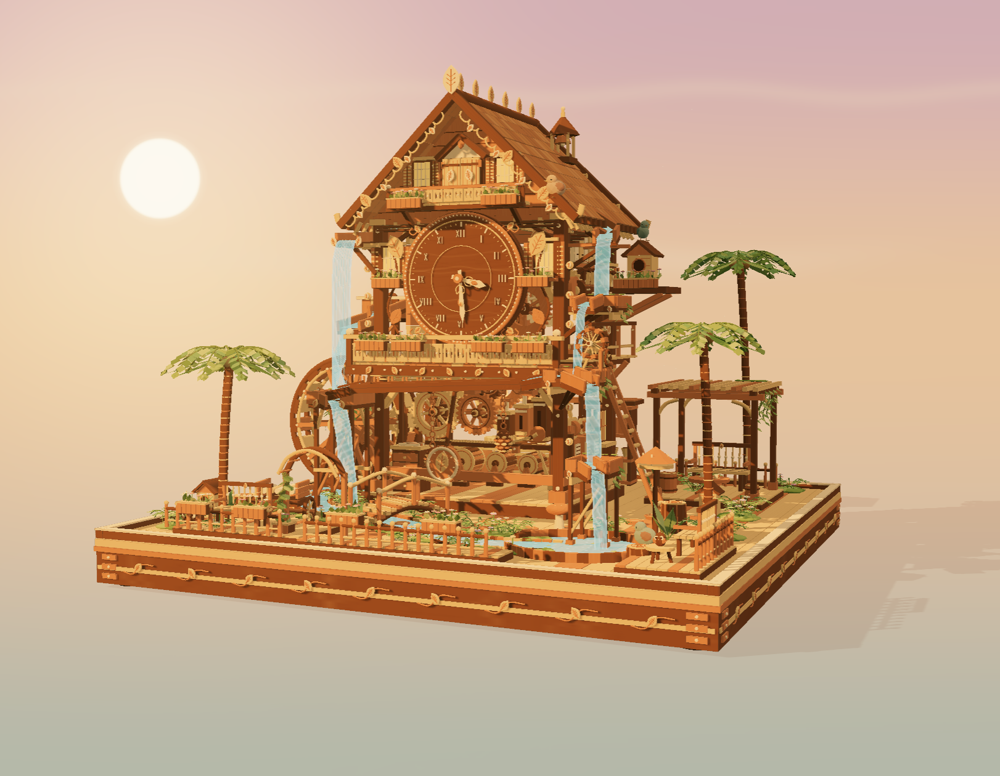
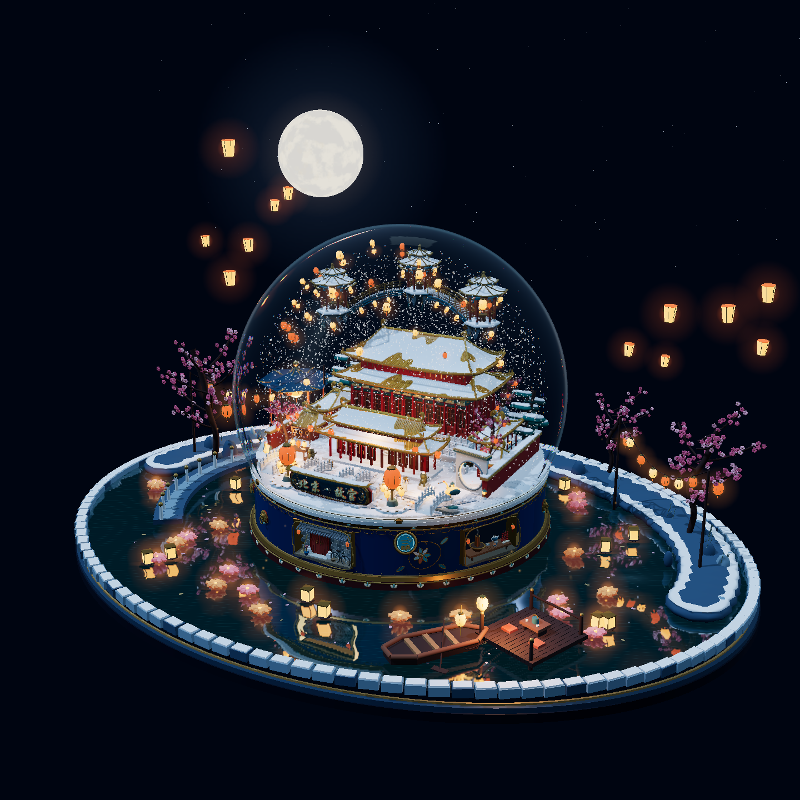

# gpt6-Astra_3.js

四个使用 Three.js 制作的可交互微缩场景，均为独立 HTML 文件。Three.js r169 与 OrbitControls 已内联，无需安装 npm 依赖。

| 作品 | 场景 |
| --- | --- |
| [海风之屿](海风之屿.html) | 海岛、木屋、灯塔、码头与浅海 |
| [雨夜便利店](雨夜便利店.html) | 便利店街角、店内货架、降雨与积水反光 |
| [木漏时光](木漏时光.html) | 木制布谷钟、水车、机关、分层流水与夕阳 |
| [北京故宫雪景水晶球](北京故宫雪景水晶球.html) | 故宫意象、空中楼阁、玻璃折射与可交互风雪 |

## 作品预览

以下为四个场景在浏览器中的实际运行截图。

### 海风之屿

### 雨夜便利店

### 木漏时光

### 北京故宫雪景水晶球

故宫意象的幻想微缩场景，包含 8200 片八类实体雪晶。点击底座“起风”可扬雪，连点叠加阵风，拖动球壳可扰动雪。

[制作与修改教程](docs/forbidden-city-tutorial.md) · [场景说明](docs/forbidden-city-scene.md)

## 分享与下载

- 项目主页：[gpt6-Astra_3.js](https://github.com/XinyuWang250428/gpt6-Astra_3.js)
- 下载全部作品：[main 分支 ZIP](https://github.com/XinyuWang250428/gpt6-Astra_3.js/archive/refs/heads/main.zip)
- 在线演示：目前未启用 GitHub Pages；下方提供本地运行方法。

## 运行

下载仓库 ZIP 并解压，用支持 WebGL 2 的现代浏览器打开对应 HTML。GitHub 文件页面展示源代码，需下载到本地运行。

也可以在解压目录运行 `python -m http.server 8000`，然后访问 `http://localhost:8000/`。

## 交互

- 鼠标左键拖拽：围绕模型旋转。
- 滚轮：缩放。
- 鼠标右键拖拽：平移。

场景包含持续运行的细微动效，画面流畅度取决于设备的图形性能。

## 依赖说明

HTML 中保留了 Three.js 作者的版权声明。Three.js 与 OrbitControls 的 MIT 许可见 [THIRD_PARTY_NOTICES.md](THIRD_PARTY_NOTICES.md)。该第三方许可不自动扩大为本项目原创场景的授权声明。

