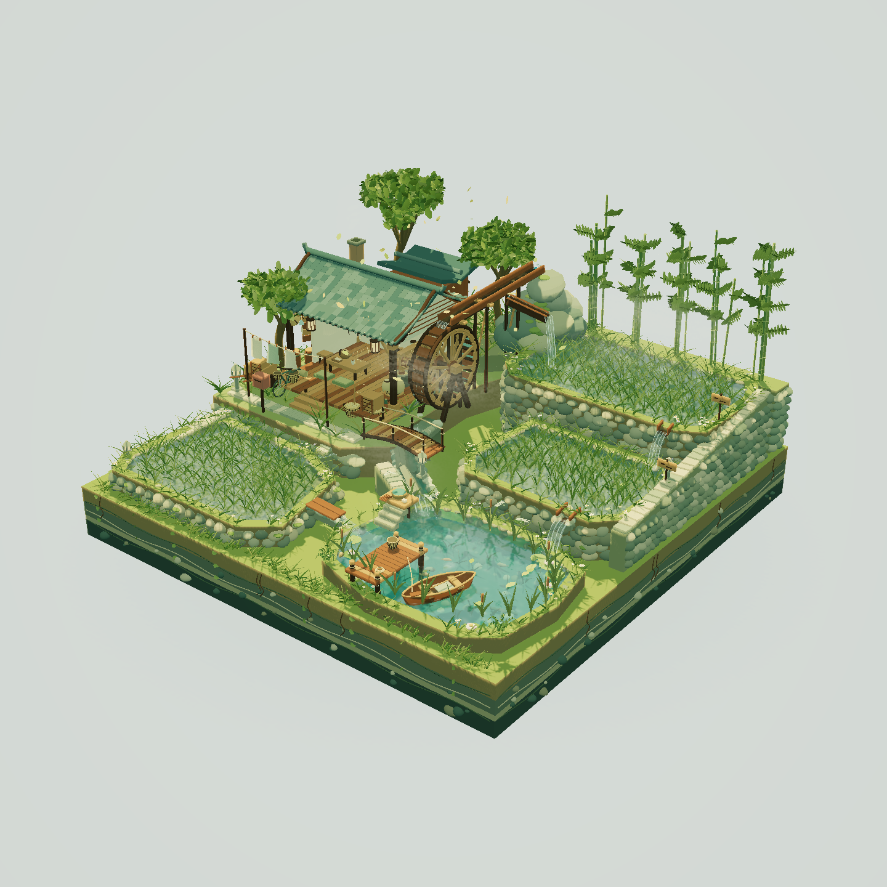

# 晨雾稻田水车村

一个可以旋转、缩放和平移的 Three.js 微缩村落。三层稻田围绕开放式农舍展开，木水车、联动齿轮、山泉引水槽、石砌田埂与前景池塘组成连续水路，配有竹林、码头与小船。

## 看点

- **高低水路**：引水槽、稻田跌水与池塘连接不同高度，配合水滴、泡沫和落点涟漪。
- **机械与自然动态**：木水车和齿轮持续运动，飘叶、游鱼与植物摆动补足场景变化。
- **晨雾与水面**：局部雾气、场景反射、深度相关折射和水底焦散形成清晨氛围；这些是实时视觉近似。
- **完整微缩底座**：侧壁包含土层、石块、根系与垂蔓，背面同样可以观察。

## 运行与操作

下载仓库 ZIP，解压后打开根目录的 `晨雾稻田水车村.html`。Three.js r169、OrbitControls 和场景源码均已内联，不需要 npm 或联网加载模型。使用支持 WebGL 2 的现代浏览器。

左键拖拽旋转，滚轮缩放，右键拖拽平移；刷新页面恢复初始视角。场景会持续播放动画，性能取决于设备和窗口尺寸。

## 阅读代码

在独立 HTML 内搜索 `fields` 查看地形水面分层，`fallRoutes` 查看跌水路径，`renderVillage` 查看渲染流程。调试接口 `window.__riceVillage` 可查看相机、动画时间和相关组件。该接口面向源码学习，不是稳定的外部 API。

上传前在桌面 Edge 验证了初始渲染、动画推进、旋转和缩放；无页面/控制台错误、无外部HTTP请求。记录见 [运行验证](verification/two-scenes.json)。

第三方许可见根目录 [THIRD_PARTY_NOTICES.md](../THIRD_PARTY_NOTICES.md)。
