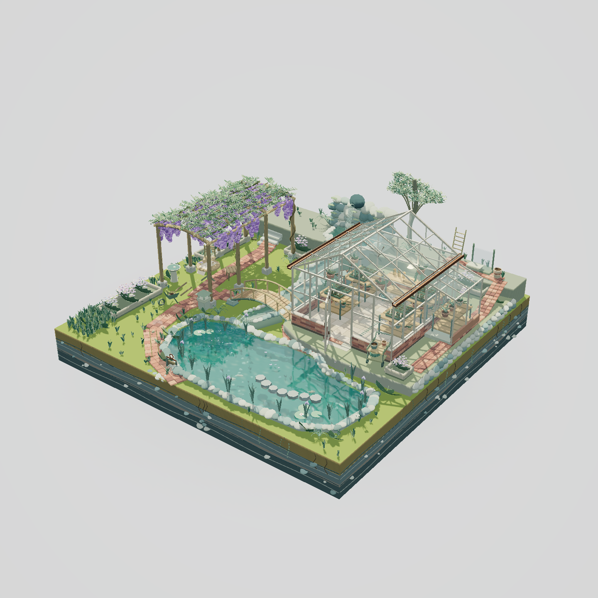

# 雨后紫藤溪谷温室

一个以玻璃温室、紫藤廊架和溪流花池为主体的 Three.js 微缩花园。透过奶油色细框玻璃，可以观察温室里的育苗台、陶盆、苗盘、工具和局部暖灯。

## 看点

- **温室内外**：透明玻璃、外开门、通风窗连杆、铜雨槽和储水罐，与内部园艺工作区共同构成完整空间。
- **紫藤廊架**：126串立体花序随风摆动，廊架下有桌椅、茶杯与书；空中落花延续雨后氛围。
- **连续溪流**：后部泉池、阶梯跌水、桥下溪流和浅水花池连接，加入残滴、波纹和水下生态。
- **背面细节**：维护路、梯子、备用玻璃架与空盆，以及底座页岩、细根与垂蔓。

水流、反射、折射、焦散和花叶空气动力均采用适合风格化场景的实时近似。

## 运行与操作

下载仓库 ZIP，解压后打开根目录的 `雨后紫藤溪谷温室.html`。Three.js r169、OrbitControls 和场景源码均已内联，无需 npm 或外部素材。使用支持 WebGL 2 的现代浏览器。

左键拖拽旋转，滚轮缩放，右键拖拽平移；刷新页面恢复初始视角。实际帧率随设备和窗口尺寸变化。

## 阅读代码

在独立 HTML 内搜索 `greenhouse` 查看温室分组，`racemes` 查看紫藤花序，`renderVillage` 查看渲染流程。调试接口 `window.__wisteriaGarden` 暴露相机、动画时间及场景组件；它面向本项目检查，不是稳定的外部 API。

上传前在桌面 Edge 验证了初始渲染、动画推进、旋转和缩放；无页面/控制台错误、无外部HTTP请求。记录见 [运行验证](verification/two-scenes.json)。

第三方许可见根目录 [THIRD_PARTY_NOTICES.md](../THIRD_PARTY_NOTICES.md)。
